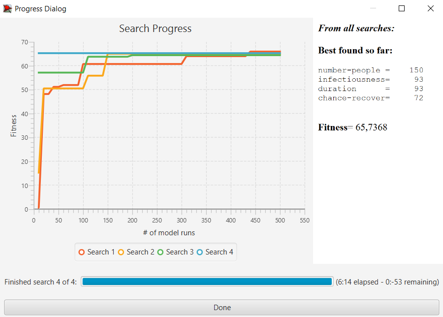

## Комп'ютерні системи імітаційного моделювання
## СПм-22-5, **Бондар Олег Володимирович**
### Лабораторна робота №**3**. Використання засобів обчислювального интелекту для оптимізації імітаційних моделей

 

### Варіант 3, модель у середовищі NetLogo:
[Virus](http://https://www.netlogoweb.org/launch#https://www.netlogoweb.org/assets/modelslib/Sample%20Models/Biology/Virus.nlogo)

 

### Налаштування середовища BehaviorSearch:

**Обрана модель**:
<pre>
Virus.nlogo
</pre>
**Параметри моделі** (вкладка Model):  

<pre>
["number-people" 150]
["infectiousness" [0 1 99]]
["duration" [0 1 99]]
["chance-recover" [0 1 99]]
</pre>

Для фітнес-функції було обрано **значення відсотка хворих людей у популяції**, для її розрахунку взято глобальну змінну **%infected** з коду моделі:
<pre>
  globals
  [ %infected            ;; what % of the population is infectious
    %immune              ;; what % of the population is immune
    lifespan             ;; the lifespan of a turtle
    chance-reproduce     ;; the probability of a turtle generating an offspring each tick
    carrying-capacity    ;; the number of turtles that can be in the world at one time
    immunity-duration ]  ;; how many weeks immunity lasts
</pre>
та вказано у параметрі "**Measure**":
<pre>
%infected 
</pre>

Відсоток хворих людей у популяції має розраховуватись **в середньому** за весь період симуляції тривалістю, адже потрібно знайти значення для ідеального вірусу, який весь час "сидить" у максимальній кількості людей.
Параметр "**Mesure if**" встановлено зі значенням true. Параметр зупинки за умовою ("**Stop if**") не використовувався. Наспраді, проводились симуляції зі значенням **Stop if**.
Але при цьому викривлялися результати, тому було вирішено не використовувати цей параметр.
Загальний вигляд вкладки налаштувань параметрів моделі:  

**Налаштування цільової функції** (вкладка Search Objective):  
Метою підбору параметрів імітаційної моделі для визначення значення "**%infected**" (відсоток хворих людей у популяції) є максимізація цього показника через параметр "**Goal**" зі значенням "**Maximize Fitness**". Це означає, що необхідно налаштувати параметри моделі так, щоб досягти максимально можливого значення "%інфікованих" в популяції, тобто знайти найпристосованіший і найживучіший вірус.

Для досягнення цієї мети, використовується параметр "**Collected measure**", який вказує спосіб обліку цього показника. У цьому випадку, встановлено значення "**MEAN_ACROSS_STEPS**". Це означає, що цікавить не просто значення "**%infected**" в певний момент симуляції, а середнє значення цього показника за весь час проведення симуляції.

Для зниження впливу випадкових факторів на результати, кожна симуляція проводиться десять разів, і після цього результат розраховується як середнє арифметичне цих десяти запусків. Це допомагає зменшити випадкові відхилення і забезпечити більш надійний результат.
Загальний вигляд вкладки налаштувань цільової функції: 

**Налаштування алгоритму пошуку** (вкладка Search Algorithm):  

Загальний вид вкладки налаштувань алгоритму пошуку:  

 

### Результати використання BehaviorSearch:
Діалогове вікно запуску пошуку :  

Результат пошуку параметрів імітаційної моделі, використовуючи **генетичний алгоритм**:  

Результат пошуку параметрів імітаційної моделі, використовуючи **випадковий пошук**:  

